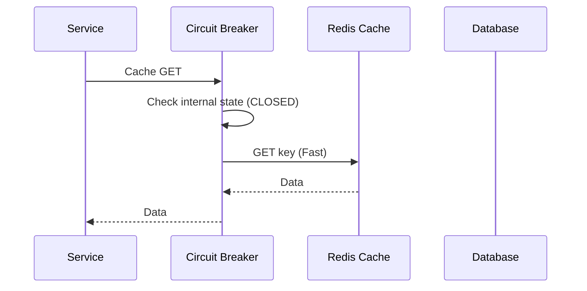
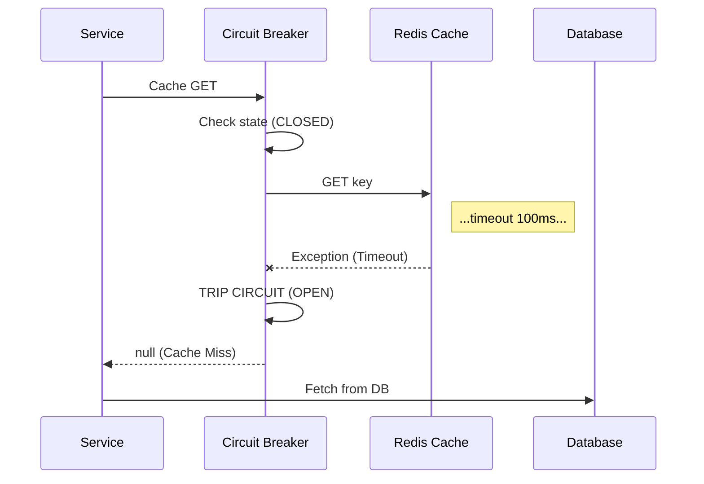
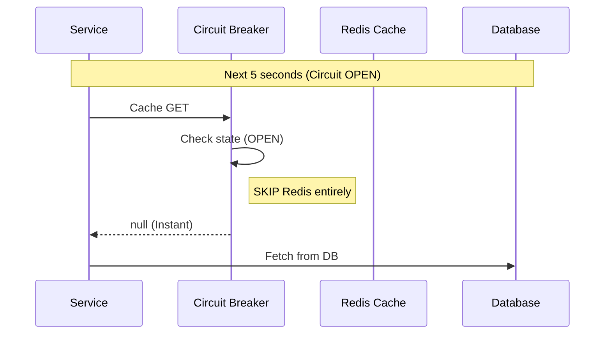
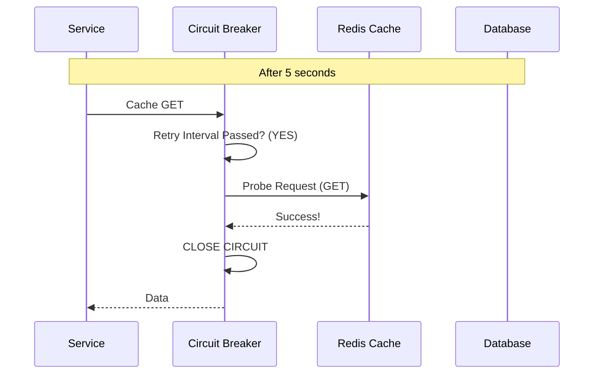

# Redis Resilience and Low-Latency Fallback

This document details the strategy and implementation used to ensure the `currency-exchange-service` remains fast and responsive even when the Redis cache is unavailable.

## The Problem: Latency During Outages

When the Redis instance goes down (e.g., node failure, network partition) or becomes unreachable:

1.  **Default Behavior:** The application attempts to connect to Redis for every cache operation (`get`, `put`, `evict`).
2.  **The Bottleneck:** Each attempt waits for a timeout period (often defaulting to 60 seconds or manually set to 500ms).
3.  **Impact:** User requests "hang" for the duration of this timeout before the application finally gives up and fetches data from the database. This repeated waiting causes massive slowdowns for every single request.

## The Solution: Two-Layer Protection

We implemented a **Zero-Latency Fallback** strategy to ensure that a down Redis node has practically **no impact** on user experience.

### 1. Layer 1: Fail-Fast Configuration
We drastically reduced the connection and command timeouts at the driver level (Lettuce). This ensures that the *initial* detection of an outage happens almost instantly.

**Configuration:** `application.properties` / `application-qa.properties`

```ini
# Timeout for Redis commands (fail fast to fallback to DB)
spring.data.redis.timeout=100ms
# Timeout for establishing a connection
spring.data.redis.connect-timeout=100ms
```

*Result:* The very first failed request waits only **100ms** instead of 1 second or more.

### 2. Layer 2: Circuit Breaker Pattern
To avoid paying that 100ms penalty for *every* subsequent request, we implemented a custom **Circuit Breaker** within the `CacheConfig`.

*   **State: Closed (Normal):** Application uses Redis normally.
*   **State: Open (Failure Mode):** After a Redis failure, the circuit "opens." The application **stops trying to contact Redis** entirely. It immediately returns `null` (cache miss) or swallows the write operation, falling back to the DB with **0ms latency**.
*   **State: Half-Open (Recovery):** The circuit stays open for a fixed interval (e.g., 5 seconds). After that, it allows **one** request to try reaching Redis.
    *   *Success:* Circuit closes, normal caching resumes.
    *   *Failure:* Circuit stays open for another 5 seconds.

## Visual Workflow

### Scenario 1: Redis is Healthy (Normal Flow)


### Scenario 2: Redis Goes Down (Fail-Fast Detection)


### Scenario 3: Redis Remains Down (Zero-Latency Fallback)


### Scenario 4: Auto-Recovery


## Key Implementation Details

The logic is encapsulated in `CacheConfig.java`.

### Circuit Breaker Logic (`ResilientCache`)

```java
// Shared state in CacheManager
private final AtomicBoolean isCircuitOpen = new AtomicBoolean(false);
private final AtomicLong lastFailureTime = new AtomicLong(0);
private static final long RETRY_INTERVAL_MS = 5000; // 5 seconds

private boolean shouldTry() {
    if (isCircuitOpen.get()) {
        long now = System.currentTimeMillis();
        // Only retry if 5 seconds have passed
        if (now - lastFailureTime.get() > retryIntervalMs) {
            return true; // Probe attempt
        }
        return false; // Fast fallback
    }
    return true;
}
```

### Handling Operations (Read)

```java
@Override
@Nullable
public ValueWrapper get(Object key) {
    // 1. Check Circuit Breaker
    if (!shouldTry()) return null; // Instant fallback to DB
    
    try {
        // 2. Try Redis (will timeout in 100ms if down)
        ValueWrapper result = delegate.get(key);
        reportSuccess(); // Close circuit if open
        return result;
    } catch (RuntimeException ex) {
        // 3. On failure, trip the circuit
        reportFailure();
        return null; // Fallback to DB
    }
}
```

This implementation handles the requirement: **"It should not fail if Redis is off; it should point to DB until Redis starts serving requests, without assuming latency costs."**
