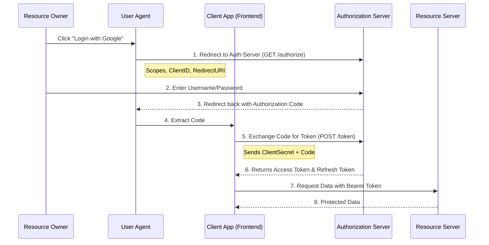
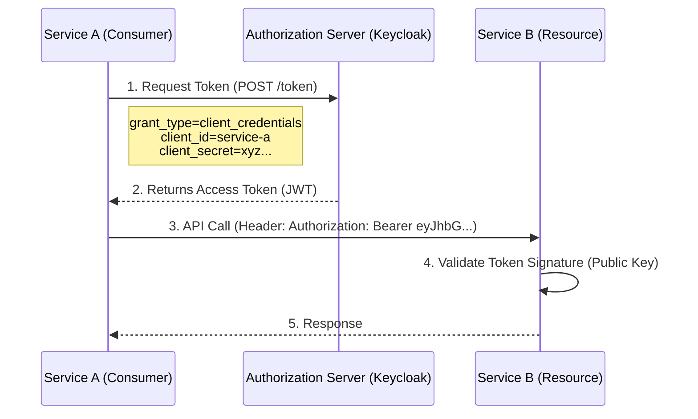

# OAuth 2.0 & OpenID Connect: The Comprehensive Guide

This document explains the internal mechanics of OAuth 2.0, the standard protocol for authorization, including flows, diagrams, and implementation details relevant to Spring Boot and Microservices.

---

## 1. What is OAuth 2.0?

OAuth 2.0 is an **authorization framework** that enables applications to obtain limited access to user accounts on an HTTP service. It delegates authentication to the service that hosts the user account (like Google, Facebook, or a corporate Identity Provider like Keycloak/Okta).

*   **Authentication (OpenID Connect - OIDC):** "Who are you?" (Identity)
*   **Authorization (OAuth 2.0):** "What are you allowed to do?" (Access)

---

## 2. Core Terminology (The Roles)

| Role | Description | Example |
| :--- | :--- | :--- |
| **Resource Owner** | The user who grants access to their data. | You (the End User) |
| **Client** | The application requesting access. | The Spring Boot App or React Frontend |
| **Authorization Server** | The server that authenticates the user and issues tokens. | Keycloak, Okta, Auth0, Google |
| **Resource Server** | The server giving access to data/api based on the token. | The Backend API / Kafka Broker |

---

## 3. The Tokens

### 1. Access Token
*   **Purpose:** The "key" used to access the Resource Server.
*   **Format:** Usually a **JWT (JSON Web Token)**.
*   **Lifespan:** Short (e.g., 5-30 minutes).

### 2. Refresh Token
*   **Purpose:** A special token used to get a *new* Access Token when the old one expires, without forcing the user to log in again.
*   **Lifespan:** Long (e.g., Days or Weeks).

### 3. ID Token (OIDC only)
*   **Purpose:** Contains profile information about the user (Name, Email, Picture).
*   **Format:** JWT.

---

## 4. Common Grant Types (Flows)

### A. Authorization Code Flow (with PKCE)
*Best for:* Web Apps, Single Page Apps (React/Angular), Mobile Apps.
This involves the user interacting with a browser.

**The Flow Diagram:**



### B. Client Credentials Flow
*Best for:* **Microservices** and **Kafka**.
This is "Machine-to-Machine" communication. No human user is involved.

*   **Scenario:** Order Service needs to talk to Inventory Service.
*   **Scenario:** Kafka Producer needs to talk to Kafka Broker.

**The Flow Diagram:**



---

## 5. JWT (JSON Web Token) Structure

An Access Token is typically a Base64 encoded string with three parts: `Header.Payload.Signature`

1.  **Header:** Algorithm details.
    ```json
    { "alg": "RS256", "typ": "JWT" }
    ```
2.  **Payload (Claims):** The data.
    ```json
    {
      "sub": "user-123",
      "iss": "https://accounts.google.com",
      "exp": 1610000000,
      "roles": ["admin", "editor"],
      "scope": "read:books write:books"
    }
    ```
3.  **Signature:** Verifies the token wasn't tampered with. Generated using the Authorization Server's **Private Key**. The Resource Server verifies it using the **Public Key**.

---

## 6. How it's done in Spring Boot

### 1. Spring Security Config (Resource Server)
When building a microservice that *receives* tokens.

**Dependencies:**
```groovy
implementation 'org.springframework.boot:spring-boot-starter-oauth2-resource-server'
```

**Configuration (`application.yaml`):**
```yaml
spring:
  security:
    oauth2:
      resourceserver:
        jwt:
          # URL to fetch Public Keys (JWK Set) to verify signatures
          issuer-uri: https://idp.example.com/realms/myrealm
          jwk-set-uri: https://idp.example.com/realms/myrealm/protocol/openid-connect/certs
```

**Java Code:**
```java
@Configuration
@EnableWebSecurity
public class SecurityConfig {
    @Bean
    public SecurityFilterChain filterChain(HttpSecurity http) throws Exception {
        http
            .authorizeHttpRequests(auth -> auth
                .requestMatchers("/public/**").permitAll()
                .anyRequest().authenticated()
            )
            .oauth2ResourceServer(oauth2 -> oauth2.jwt()); // Enable JWT validation
        return http.build();
    }
}
```

---

## 7. OAuth in Apache Kafka (SASL/OAUTHBEARER)

Kafka supports OAuth 2.0 for authentication using the **SASL OAUTHBEARER** mechanism.

1.  **The Client (Producer/Consumer):**
    *   Authenticates against the Authorization Server using `client_id` and `client_secret`.
    *   Gets a JWT.
    *   Sends JWT to Broker.

2.  **The Broker:**
    *   Validates the JWT (signature, expiration).
    *   Extracts the "principal" (client ID or user) from the token.

**Kafka Client Configuration (`application.yaml`):**

```yaml
spring:
  kafka:
    properties:
      security.protocol: SASL_SSL
      sasl.mechanism: OAUTHBEARER
      sasl.jaas.config: >
        org.apache.kafka.common.security.oauthbearer.OAuthBearerLoginModule required
        clientId="my-kafka-client"
        clientSecret="secret-123"
        oauth.token.endpoint.uri="https://idp.example.com/token";
      sasl.login.callback.handler.class: org.apache.kafka.common.security.oauthbearer.secured.OAuthBearerLoginCallbackHandler
```

---

## 8. Summary Checklist for Interviews

*   **Why OAuth?** To decouple authentication from logic and avoid sharing passwords.
*   **What is a JWT?** Stateless, signed token carrying user info.
*   **Symmetric vs Asymmetric?** OAuth usually uses Asymmetric (RS256). Identity Provider signs with Private Key; API verifies with Public Key.
*   **What if Access Token is stolen?** It can be used until it expires. That's why lifespans are short.
*   **How to revoke?** You generally can't revoke a JWT easily (stateless). You revoke the *Refresh Token* so the attacker can't get a new Access Token.

---

## 9. OAuth 2.0 vs. JWT: Clearing the Confusion

A common interview question (and confusion) is "What is the difference between OAuth and JWT?". This is like asking "What is the difference between a **Process** and the **Result** of that process".

| Feature | OAuth 2.0 | JWT (JSON Web Token) |
| :--- | :--- | :--- |
| **Definition** | It is an **Authorization Framework / Protocol** (RFC 6749). | It is a **Token Format / Standard** (RFC 7519). |
| **Purpose** | Defines **how** clients authenticate and get authorization (the flows, the redirects, the handshakes). | Defines **what** the token looks like and how to verify it (Header.Payload.Signature). |
| **Analogy** | The **Check-in Process** at a hotel (Showing ID, Credit Card). | The **Key Card** you receive at the end to access your room. |
| **Relationship** | OAuth 2.0 *produces* and *uses* tokens. These tokens are often JWTs, but they could also be simple UUIDs (Opaque Tokens). | JWT is just a file format. It is the most popular choice for "Access Tokens" and "ID Tokens" generated by OAuth 2.0 flows. |

**Key Takeaway:**
*   You **do** OAuth 2.0 (the handshake) to **get** a JWT (the credential).
*   OAuth handles the "Log in with Google" button. JWT handles the actual data passing between your API and the client.

---

## 10. Token Storage & Usage: Where do they go?

### 1. Where to Store Tokens?

#### A. In the Browser (SPA - React/Angular)
There are two main schools of thought:

1.  **LocalStorage / SessionStorage**:
    *   *Pros:* Easiest to implement. Easy for JS to read and attach to headers.
    *   *Cons:* **Vulnerable to XSS** (Cross-Site Scripting). If malicious JS runs on your page, it can steal the token.
2.  **HttpOnly Cookies (Recommended)**:
    *   *Pros:* JS cannot read the cookie. Immune to XSS token theft.
    *   *Cons:* Vulnerable to CSRF (Cross-Site Request Forgery), requires anti-CSRF tokens.
    *   *Best Practice:* Use the **"Backend for Frontend" (BFF)** pattern. The backend handles the tokens; the browser just has a session cookie.

#### B. In Mobile Apps
*   **iOS:** Keychain Services.
*   **Android:** EncryptedSharedPreferences / Keystore.

#### C. In Microservices (Machine-to-Machine)
*   **In-Memory:** Simple variables. If the app restarts, it just requests a new token.
*   **Distributed Cache (Redis):** If you want to share tokens across multiple instances to avoid spamming the Auth Server.

### 2. How to Use Them?

#### A. The Access Token
It is sent in the HTTP **Authorization** header with every request to the API.

```http
GET /api/books
Authorization: Bearer <your-access-token-jwt>
```

#### B. The Refresh Token
It is **NEVER** sent to the Resource Server (API). It is strictly shared between the **Client** and the **Authorization Server**.

**The Lifecycle:**
1.  **Access (To Resource Server):** Client sends request `GET /api` with **Access Token**.
2.  **Expiry (From Resource Server):** API returns `401 Unauthorized` (because Token Expired).
3.  **Catch & Renew (Client Internal):** Client catches the 401 error.
4.  **Exchange (To Auth Server):** Client calls the **Authorization Server**: `POST /token` with `grant_type=refresh_token` and the **Refresh Token**.
    *   *Note: The Resource Server never sees the Refresh Token.*
5.  **Update (From Auth Server):** Auth Server returns a **New** Access Token (and optionally a new Refresh Token).
6.  **Retry (To Resource Server):** Client retries the original `GET /api` request with the new Access Token.

---

## 11. Who Creates the Refresh Token?

**Short Answer:** The **Authorization Server** creates it.
*   **Resource Server (API):** NEVER creates tokens. It only validates them.
*   **Client:** NEVER creates tokens. It only requests and stores them.

### How to create it in Spring Boot?
You normally **don't** write code to create tokens manually. You use an Authorization Server product (Keycloak, Okta, Auth0).

However, if you are **building your own** Authorization Server using **Spring Authorization Server**, here is how you enable it:

1.  **Dependency:** `org.springframework.boot:spring-boot-starter-oauth2-authorization-server`
2.  **Configuration:** You must explicitly enable the `REFRESH_TOKEN` grant type for your client.

```java
@Bean
public RegisteredClientRepository registeredClientRepository() {
    RegisteredClient registeredClient = RegisteredClient.withId(UUID.randomUUID().toString())
        .clientId("my-client-app")
        .clientSecret("{noop}secret-123")
        .clientAuthenticationMethod(ClientAuthenticationMethod.CLIENT_SECRET_BASIC)
        .authorizationGrantType(AuthorizationGrantType.AUTHORIZATION_CODE)
        .authorizationGrantType(AuthorizationGrantType.REFRESH_TOKEN) // <--- THIS LINE IS KEY
        .redirectUri("http://127.0.0.1:8080/authorized")
        .scope("read")
        .build();

    return new InMemoryRegisteredClientRepository(registeredClient);
}
```

**How it works internally:**
1.  Spring Security sees `AuthorizationGrantType.REFRESH_TOKEN`.
2.  When the user logs in, Spring generates a random String (UUID) to serve as the Refresh Token.
3.  It stores this token in its internal database (JDBC/In-Memory) linked to that specific user session.
4.  It returns it to the client.
