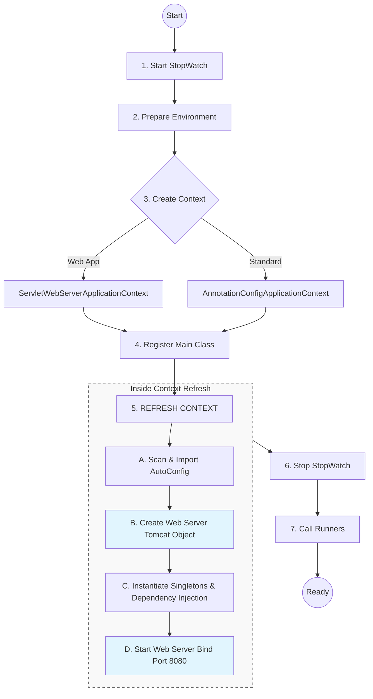

# Spring Boot Internals: What happens inside `SpringApplication.run()`?

When you write this simple line of code:

```java
SpringApplication.run(SpringDemoApplication.class, args);
```

You are triggering a complex sequence of ~15 steps. Here is the simplified breakdown of what happens internally, step-by-step.

---

## 1. The Setup (Before execution starts)
Even before the line executes, Spring checks:
- **Application Type**: Is this a Web Application (Servlet)? A Reactive Application? or a Standalone CLI app? It decides this by checking if specific classes (like `DispatcherServlet`) are present on the classpath.
- **Bootstrappers**: It loads initializers and listeners defined in `META-INF/spring.factories` (or `spring.factories` + `imports` in Boot 3).

---

## 2. The `run()` Method Execution Flow

### Step A: Start the Stopwatch
Spring starts a `StopWatch`. This is purely to calculate those seconds you see in the logs: *"Started Application in 2.43 seconds"*.

### Step B: Prepare the Environment
1. **Load Properties**: It gathers all configuration from:
   - System Environment Variables.
   - Java System Properties.
   - Command Line Arguments (`args`).
   - `application.properties` / `application.yml` files.
2. **Active Profiles**: It decides which profile is active (e.g., `dev`, `prod`).

### Step C: Create the ApplicationContext (The "Container")
The "Context" is the brain of your application where all Beans live.
- If it's a **Web App**, it creates an `AnnotationConfigServletWebServerApplicationContext`.
- If it's **Reactive**, it creates a `ReactiveWebServerApplicationContext`.
- Otherwise, a generic `AnnotationConfigApplicationContext`.

### Step D: Prepare the Context
Before creating beans, Spring needs to configure the empty container:
1. It links the **Environment** (Step B) to the Context.
2. It registers your main class (`SpringDemoApplication`) as the **first Bean** in the factory. This is crucial because this class has the `@SpringBootApplication` annotation, which triggers everything else.

### Step E: Refresh the Context (The Heavy Lifting)
This is where 90% of the work happens. The method is called `refresh()`.

1. **Scan and Parse (Order Matters!)**:
   - **First**: It processes **`@ComponentScan`**. It finds all your user-defined beans (`@Controller`, `@Service`, `@Repository`) and registers their definitions.
   - **Second**: It processes **`@EnableAutoConfiguration`**. It looks at the classpath and tries to add default beans.
   - **Why this order?**: Auto-configuration heavily uses `@ConditionalOnMissingBean`. It needs to see if *you* created a bean first. If you did (via Component Scan), auto-config skips creating its default version.
2. **Bean Destinition Loading**: It doesn't create objects yet; it creates "definitions" (plans) for every bean it found.
3. **Web Server Startup**:
   - If it's a web app, Spring creates and starts the Embedded Web Server (Tomcat, Jetty, or Undertow).
   - This happens *during* the refresh.
4. **Instantiate Singletons**:
   - Now it actually **creates the objects** (Instances).
   - It performs **Dependency Injection** (injecting Service into Controller, Repository into Service).
   - It runs `@PostConstruct` methods.

### Step F: Running Runners
After the context is fully refreshed, Spring calls:
1.  **`CommandLineRunner`**
2.  **`ApplicationRunner`**
These are your hooks to run code once the app is "up."

---

## 3. The Shutdown Flow (Ending of Spring)
What happens when you call `context.close()` or hit `Ctrl+C`?

1.  **Shutdown Hook Triggered**: Spring registers a JVM shutdown hook.
2.  **Event Broadcast**: An `ContextClosedEvent` is published.
3.  **Destruction Phase**:
    - **`@PreDestroy`** methods are called.
    - **`DisposableBean.destroy()`** is called.
    - Custom `destroy-method` in `@Bean` is called.
4.  **Close BeanFactory**: The container stops creating or serving beans.
5.  **Stop Web Server**: Tomcat/Jetty is stopped, closing all open ports and connections.
6.  **JVM Exit**: Once all threads are stopped, the JVM process terminates.

---

## 4. Component Scan vs Auto-Configuration: Which is first?
**ANSWER: Component Scan is First.**

1.  **Component Scan** reads your code and registers your beans.
2.  **Auto-Configuration** then runs and says: *"I see the user didn't define a DataSource (checked via @ConditionalOnMissingBean), so I will create a default one."*
- If Auto-Configuration ran first, it would create default beans for everything, and your custom beans would cause "Duplicate Bean" errors.

---

## Summary Diagram



---

## Why does this matter for interviews?
1. **"When does Tomcat start?"**: It starts during the context refresh step, specifically when the `ServletWebServerFactory` bean is requested.
2. **"Why is my CommandLineRunner null?"**: It can't be null if it runs, but if dependencies inside it are null, maybe the context didn't initialize them correctly.
3. **"How does Spring know to look in my package?"**: Because your main class is registered first, and `@SpringBootApplication` includes `@ComponentScan` which defaults to the main class's package.
